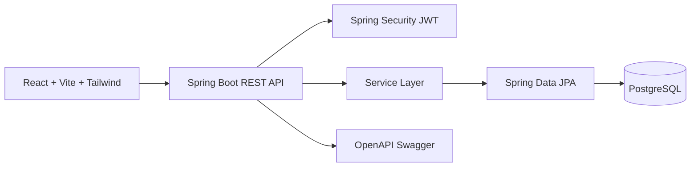
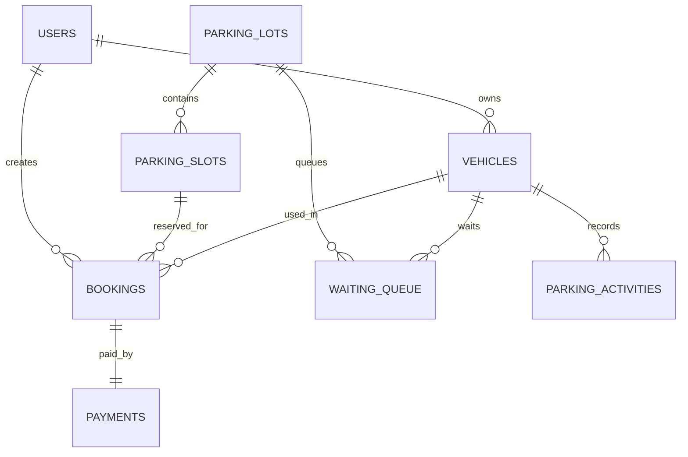

# SmartParkPro

Enterprise-grade Smart Parking Management System built with Java 21, Spring Boot 3, JWT security, Spring Data JPA, PostgreSQL, Swagger, React, Vite, and TailwindCSS.

## Features

- JWT authentication with Admin, Staff, and Customer roles
- Full CRUD for parking lots, parking slots, vehicles, bookings, users, and payments
- FIFO waiting vehicle queue for full parking lots
- Recent parking activity stack
- Dashboard metrics for vehicles, slots, and revenue
- AI-style demand prediction, slot recommendation, and analytics dashboard
- QR parking tickets generated at booking time with entry and exit scan APIs
- Optional email notifications for booking confirmation, slot assignment, and payment receipts
- Flyway SQL schema and seed data
- Swagger/OpenAPI documentation
- Docker and Docker Compose deployment
- Unit, repository, service, controller, and integration test structure with JaCoCo coverage gate

## Quick Start

```bash
docker compose up --build
```

Open:

- Frontend: `http://localhost:3000`
- Backend: `http://localhost:8080`
- Swagger: `http://localhost:8080/swagger-ui.html`

Seed users all use password `password`:

| Role | Email |
|---|---|
| Admin | `admin@smartparkpro.com` |
| Staff | `staff@smartparkpro.com` |
| Customer | `customer@smartparkpro.com` |

## Local Development

Backend:

```bash
cd backend
mvn spring-boot:run
```

Frontend:

```bash
cd frontend
npm install
npm run dev
```

PostgreSQL defaults:

- Database: `smartparkpro`
- Username: `smartpark`
- Password: `smartpark`

## Testing

```bash
cd backend
mvn clean test
mvn verify
```

JaCoCo is configured to enforce 80% line coverage during `mvn verify`.

Frontend:

```bash
cd frontend
npm test
```

## Screenshots

Place screenshots in `docs/screenshots/`:

- `docs/screenshots/login.png`
- `docs/screenshots/dashboard.png`
- `docs/screenshots/analytics.png`
- `docs/screenshots/queue.png`
- `docs/screenshots/swagger-crud.png`
- `docs/screenshots/jacoco-coverage.png`
- `docs/screenshots/github-actions.png`
- `docs/screenshots/qr-ticket.png`

See [docs/TESTING_CHECKLIST.md](docs/TESTING_CHECKLIST.md) for the Swagger CRUD checklist and portfolio evidence checklist.

## Architecture





## Production Configuration

Set these environment variables:

```bash
SPRING_PROFILES_ACTIVE=prod
SPRING_DATASOURCE_URL=jdbc:postgresql://<host>:5432/smartparkpro
SPRING_DATASOURCE_USERNAME=<user>
SPRING_DATASOURCE_PASSWORD=<password>
JWT_SECRET=<strong-512-bit-secret>
CORS_ALLOWED_ORIGINS=https://your-frontend.example.com
MAIL_NOTIFICATIONS_ENABLED=true
MAIL_HOST=smtp.example.com
MAIL_PORT=587
MAIL_USERNAME=<smtp-user>
MAIL_PASSWORD=<smtp-password>
MAIL_FROM=no-reply@your-domain.com
```

Use `docker-compose.yml` as the reference deployment topology: PostgreSQL, backend API, and Nginx-served frontend.

## API Docs

See [docs/API.md](docs/API.md) or run the backend and open Swagger UI.
